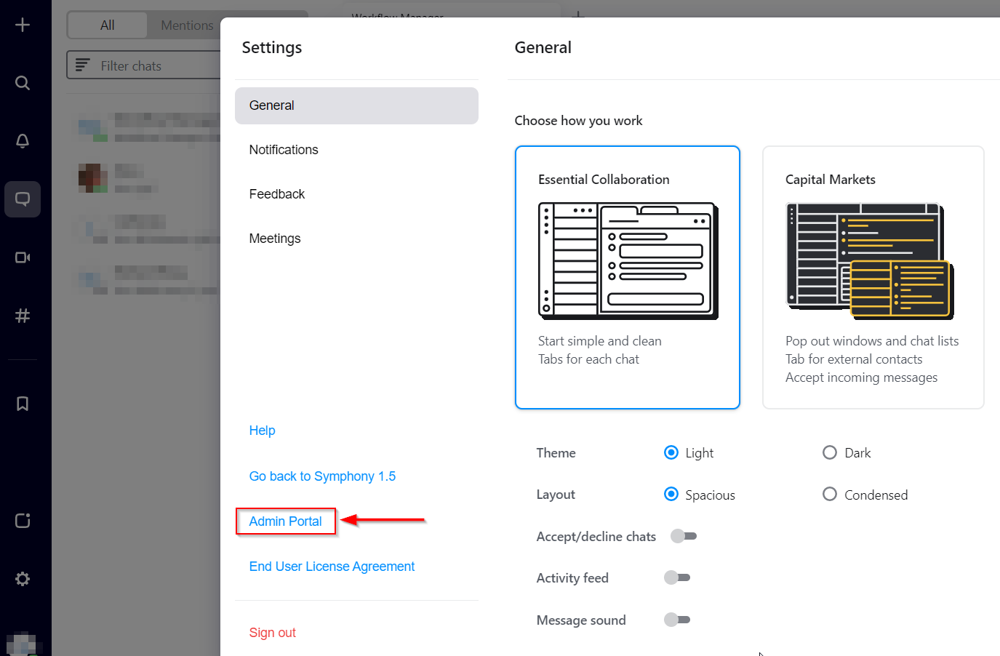
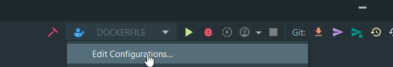
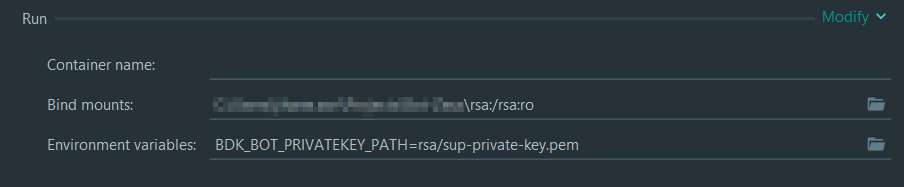

# Template Java Bot

This is a template repository to be used by the [ProfServ team](https://perzoinc.atlassian.net/wiki/spaces/PS/overview) 
to create new Java Bots.

To use this template, replace all instances of `#template#` in this repository by your bot name.

Please, read our [Best Practices](https://perzoinc.atlassian.net/wiki/spaces/PS/pages/2242905098/Best+Practices) before contributing.

To develop Symphony bots, we use the Symphony Bot Developer Kit 2.0 (BDK).
Here's the link to the [documentation](https://docs.developers.symphony.com/building-bots-on-symphony/building-bots-on-symphony).

* Language: *Java*
* Framework: *Spring*

## Bot functionalities

**TODO** Add here your bot documentation.

## Running the bot locally

There are three levels of testing for the bot locally during development:

1. Start the bot by running the BotApplication class directly without containerization.
2. Run the bot within a local docker container
3. Run the bot within a local kubernetes cluster

In all three cases, the bot is going to be deployed on a Symphony host platform.
The Symphony host configuration can be found in the [*application.yml*](src/main/resources/application.yaml) file,
but in a docker container this config can be overridden via environment variables. 
Before running the bot, you need to make sure it has been created and configured on that configured host platform first 
via its Admin console:

Once the bot is running, you can test it by connecting to the configured Symphony host platform and opening a chat with the bot.

### Running BotApplication directly

First, make sure that:
1. you have the private RSA key that the bot is going to use for authentication on the Symphony host in your local environment.
   (it should correspond to the public one configured on the Symphony host via its Admin console)
2. it is located at the correct path (the one configured in [*application.yml*](src/main/resources/application.yaml)).

Install the maven dependencies with `mvn install`,
then you can run [the BotApplication class](src/main/java/com/symphony/BotApplication.java).

### Running the bot in a Docker container

Package the application with maven: `mvn clean package spring-boot:repackage` then run the Dockerfile.

For security reasons, the bot's RSA key is not included in the container. 
Therefore, to be able to run it properly, you need to include the RSA key as a mounted volume.

On IntelliJ, you can edit your dockerfile run configuration and save it:

Select the Dockerfile configuration and edit the 'Run' section by adding a mount:

As seen in the image above, if the RSA key's filename you want to use in your docker container is different
from the one configured in [*application.yml*](src/main/resources/application.yaml),
you can also override the path to the rsa-key file by adding a *BDK_BOT_PRIVATEKEY_PATH* environment variable.
This works for all configurations in *application.yml*.

### Running the bot in a local Kubernetes cluster

Make sure you have kubernetes running (for Windows users, it's a feature you can enable with Docker Desktop).

This project use the [Kustomize](https://github.com/kubernetes-sigs/kustomize) tool to deploy objects on different kubernetes clusters using templates.
You'll find the base configuration in [*k8s/base*](k8s/base),
the local override in [*k8s/local*](k8s/local).
The RSA private key you're going to use needs to be copied to that local override folder
in order to be deployed as a kubernetes secret in the bot namespace
(the deployment is configured to mount that secret as a volume on the pod).

To deploy this configuration, you can run the [*k8s_local_run.sh*](k8s_local_run.sh) script
(if your local docker registry isn't running, uncomment the associated line first).

## CICD

A GitHub action to automatically deploy code to Google Cloud is configured in [the deploy file](.github/workflows/deploy-workflow.yml).
This action is called by [the master action](.github/workflows/master.yml) that runs automatically for every push 
or Pull Request to the master branch.

For it to run correctly, there are a few objects configured locally, on our GKE project, and on GitHub.

### Kubernetes configuration

This project use the [Kustomize](https://github.com/kubernetes-sigs/kustomize) tool to deploy objects on different kubernetes clusters using templates.
You'll find the base configuration in [*k8s/base*](k8s/base).
This configuration is then updated with the objects configured in [*k8s/dev*](k8s/dev).

### Google Cloud Project configuration

In order to deploy the bot on *Google Kubernetes Engine* (GKE), the following objects in our Google Cloud Project were configured:
* The *VPC networks* API is enabled and a subnet already created.
* The *Kubernetes Engine* API is enabled and the GKE development cluster already created
  (this is where the bot will be running) using said subnet.
* The *Artifact Registry* API is enabled and the "dev-bot-repository" (a docker repository) already created
  (this is where the docker image will be stocked).
* The *IAM & Admin* API is enabled and a service account was created with the following roles:
  *Kubernetes Engine Developer*, *Artifact Registry Reader* and *Artifact Registry Writer*.

### GitHub configuration

For the deployment action to work, 3 secrets were configured:
* At the Organization level a "GKE_PROJECT" and "GKE_SA_KEY" secrets: they contain the Google Project ID and the Service Account key respectively (same Service Account as mentioned above).
* An "RSA_PRIVATE_KEY" secret for the "dev" environment: it contains the RSA key needed to run the bot on the development GKE cluster.

Go to *Settings > Security/Secrets > Actions* to manage these secrets.